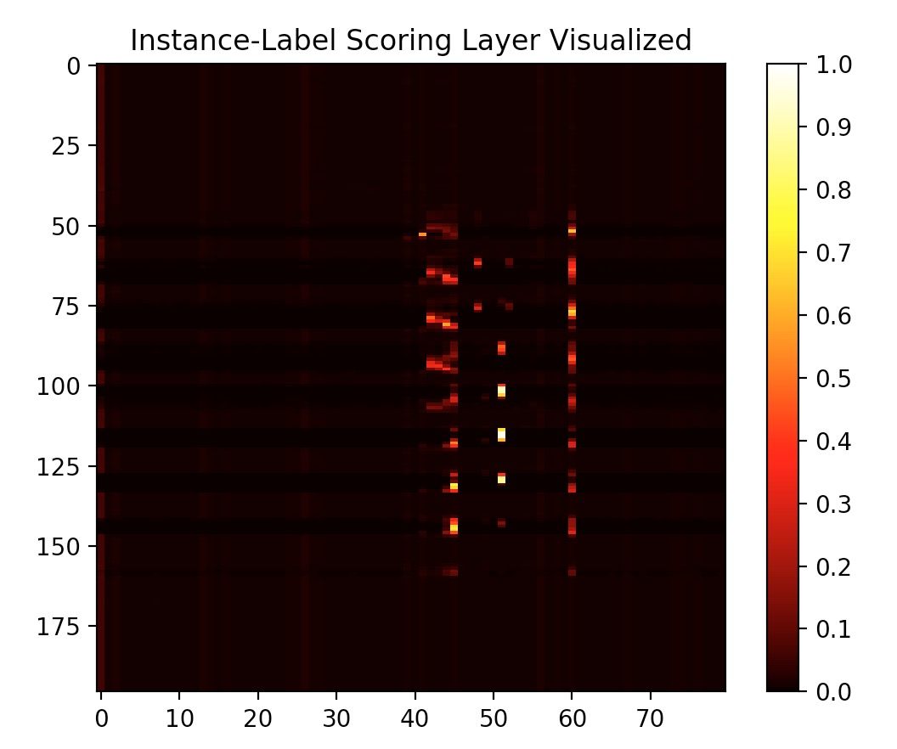
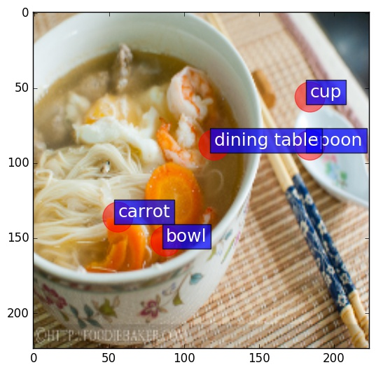
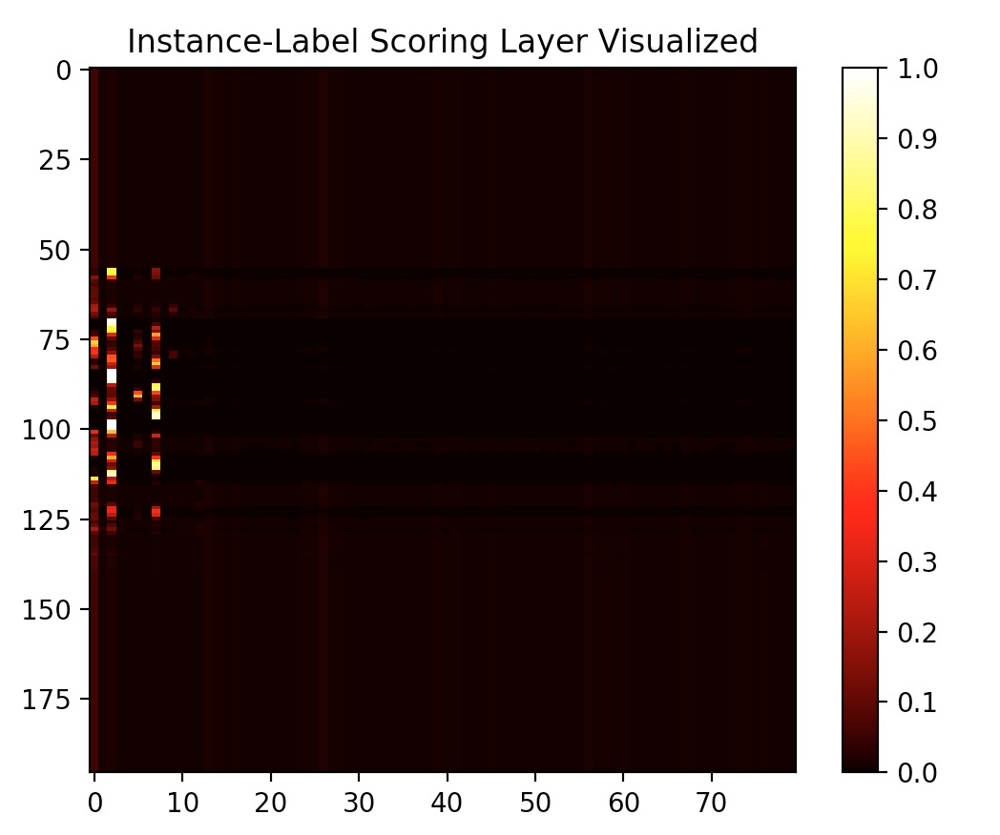
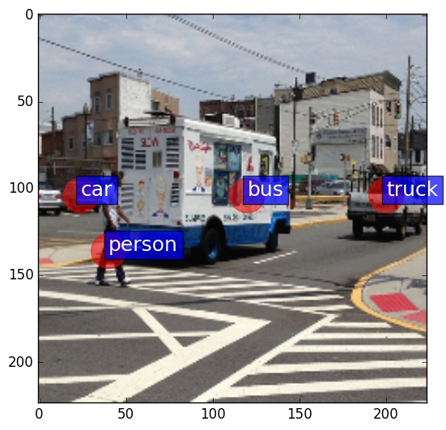

# A Keras Implementation for the DeepMIML Network 


This is the official clone for the implementation of DeepMIML Network.(The University's webserver is unstable sometimes, therefore we put the official clone here at github)

It is a deep model for multi-instance multi-label learning. 

Package Official Website: http://lamda.nju.edu.cn/code_deepmiml.ashx

This package is provided "AS IS" and free for academic usage. You can run it at your own risk. For other purposes, please contact Prof. Zhi-Hua Zhou (zhouzh@lamda.nju.edu.cn).

Reference: [1] J. Feng and Z.-H. Zhou. "DeepMIML network" In: Proceedings of the 31st AAAI Conference on Artificial Intelligence (AAAI'17), San Francisco, CA, 2017.


# File Structure
* demo/
    - The demo scipts
* lib/deepmiml
    - The DeepMIML implementation and visualization tools
* lib/pycocotools
    - The Official [COCO API](https://github.com/pdollar/coco/tree/master/PythonAPI/pycocotools)
* lib/cocodemo
    - An implementation of the COCO Datalayer used for keras to training on the COCO dataset

# Environment Requirements
The package is developed in python 2.7 with Anaconda, higher version of python hasn't been tested.

To install the requirement packages. Run the following commands

```
conda install opencv
pip install -r requirements.txt
```

Add/Modify the following two config items in ~/.keras/kears.json. 
```
"image_dim_ordering": "th"
"backend": theano
```

Compile the COCO API
```
cd lib
make
```

# COCO Data Experiment
## Download the dataset
```
mkdir -p data/coco
cd data/coco
wegt http://msvocds.blob.core.windows.net/coco2014/train2014.zip
wget http://msvocds.blob.core.windows.net/coco2014/val2014.zip
wget http://msvocds.blob.core.windows.net/annotations-1-0-3/instances_train-val2014.zip
unzip train2014.zip
unzip val2014.zip
unzip instances_train-val2014.zip
```
## Download the pretraind VGG16 Model
Goto the webpage: https://gist.github.com/baraldilorenzo/07d7802847aaad0a35d3

Download the the [vgg16_weights.h5](https://drive.google.com/file/d/0Bz7KyqmuGsilT0J5dmRCM0ROVHc/view?usp=sharing) posted by the author.

Put the model file into models/imagenet/vgg

## Train the DeepMIML network
This script will train the DeepMIML with 10 epochs, and save the model file in outputs/coco_2014_train/miml_vgg_16

Modify demo/demo_train_miml_vgg.py to change hyper-parameters for training configurations.

```
python demo/demo_train_miml_vgg.py
```


## Visualization  

If you want to Visualize the MIML analysis for the n-th image in the test set, 
run the command below: (here n is 2)


(--data 2 means use the 2nd image in the coco validatation dataset.)


```
python demo/demo_vis_miml_vgg.py --model outputs/coco_2014_train/miml_vgg_16 --data 1
python demo/demo_vis_miml_vgg.py --model outputs/coco_2014_train/miml_vgg_16 --data 2
```
It will produce 2 visualization per test sample: (as illustrated in the original paper)

The result for the first image:





The result for the second image:






## Result Evaluation

```
python demo/demo_test_miml_vgg.py --model outputs/coco_2014_train/miml_vgg_16
```

